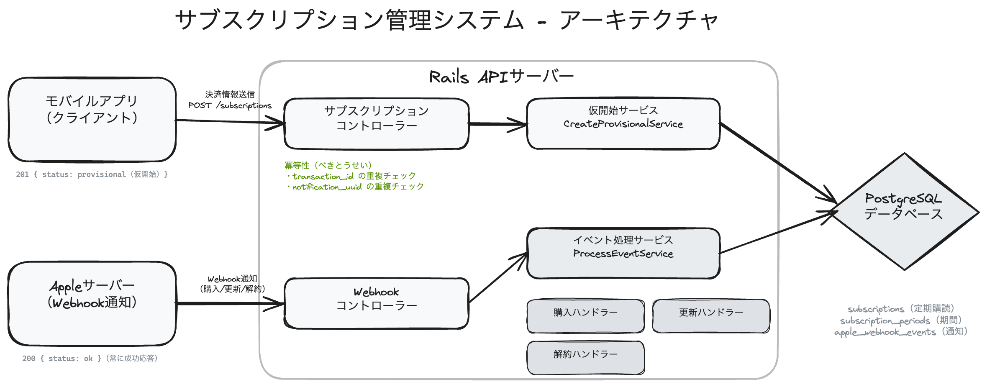
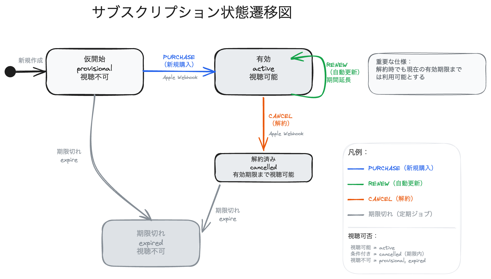
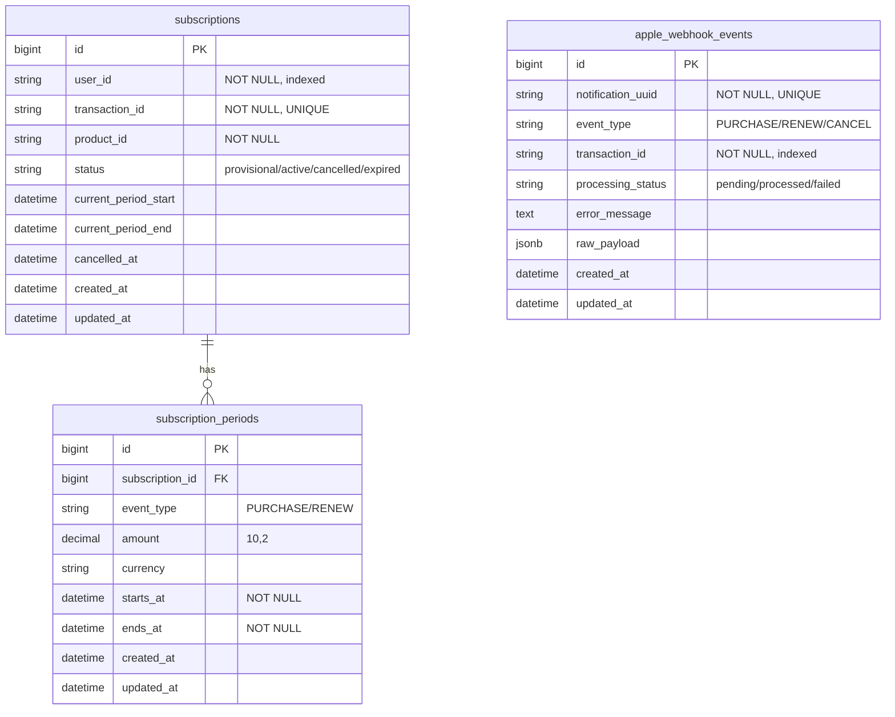
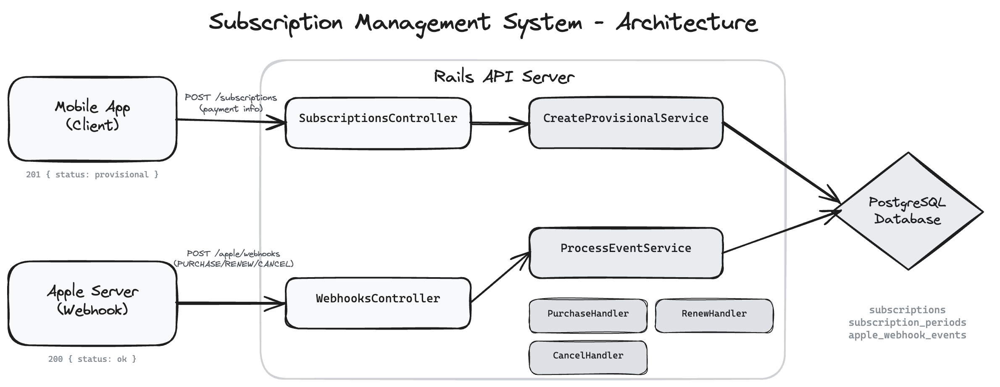
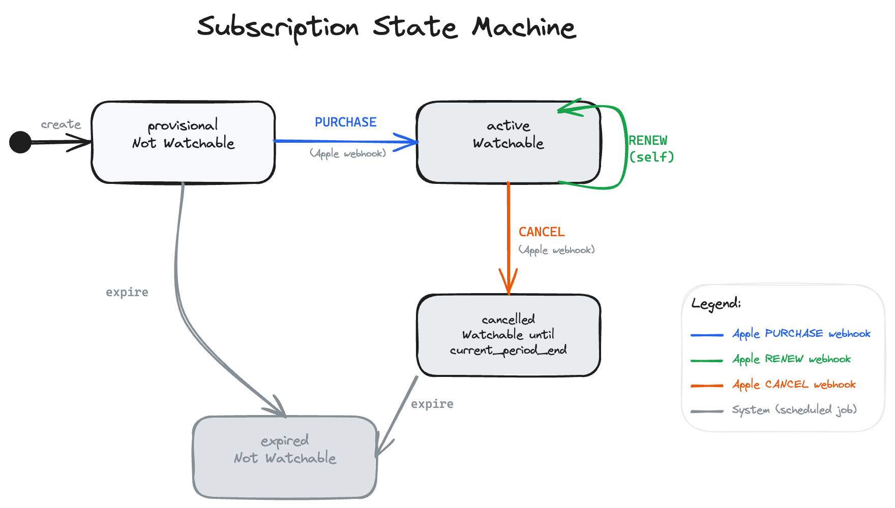

# サブスクリプション管理システム - Samansa 技術課題 / コーディングテスト

Apple In-App Purchaseを通じた動画配信サービスのサブスクリプション管理のためのRuby on Rails API。仮開始、有効化、更新、解約のライフサイクル全体を処理します。

> **Note:** [English version](#subscription-management-system---samansa-技術課題--コーディングテスト) is available below.

## 目次

- [設計概要](#設計概要)
- [アーキテクチャ](#アーキテクチャ)
- [ステートマシン](#ステートマシン)
- [APIエンドポイント](#apiエンドポイント)
- [データベース設計](#データベース設計)
- [主要な設計判断](#主要な設計判断)
- [セットアップと実行](#セットアップと実行)
- [テスト](#テスト)

---

## 設計概要

### 定義された要件

仕様に基づき、以下の要件を特定し実装しました:

1. **仮開始サブスクリプション** — ユーザーがクライアントアプリで決済を完了すると、仮開始(provisional)状態のサブスクリプションが作成されます。この状態ではユーザーはコンテンツを視聴**できません**。
2. **Webhookによる有効化** — Appleが取引を確認するため`PURCHASE` webhookを送信します。この時点でサブスクリプションは`active`となり、視聴可能になります。
3. **更新** — Appleが自動更新時に`RENEW` webhookを送信します。`active`状態を維持しながら、サブスクリプション期間が延長されます。
4. **猶予期間付き解約** — Appleが`CANCEL` webhookを送信します。サブスクリプションの状態は`cancelled`に変わりますが、ユーザーは`current_period_end`まで**コンテンツを視聴可能**です(解約時でも現在の有効期限までは利用可能)。
5. **冪等性** — サブスクリプション作成とwebhook処理の両方が冪等であり、重複リクエストと競合状態を安全に処理します。
6. **署名検証** — 仕様に従いスキップ(署名検証は省略)。

---

## アーキテクチャ



### プロジェクト構造

```
app/
├── controllers/
│   ├── application_controller.rb
│   └── api/v1/
│       ├── subscriptions_controller.rb
│       └── apple/webhooks_controller.rb
├── models/
│   ├── subscription.rb                    # AASMステートマシン
│   ├── subscription_period.rb
│   └── apple_webhook_event.rb             # 冪等性ログ
├── serializers/
│   └── subscription_serializer.rb
└── services/
    ├── service_result.rb                  # 成功/失敗/重複結果オブジェクト
    ├── subscriptions/
    │   └── create_provisional_service.rb  # 冪等な作成
    └── webhooks/apple/
        ├── process_event_service.rb       # イベントディスパッチャ
        ├── purchase_handler.rb            # PURCHASE (仮開始 → 有効)
        ├── renew_handler.rb               # RENEW (期間延長)
        └── cancel_handler.rb              # CANCEL (有効 → 解約)

db/
├── migrate/
│   ├── *_create_subscriptions.rb
│   ├── *_create_subscription_periods.rb
│   └── *_create_apple_webhook_events.rb
└── schema.rb

spec/                                      # テストファイル
├── factories/
│   ├── subscriptions.rb
│   ├── subscription_periods.rb
│   └── apple_webhook_events.rb
├── models/
│   ├── subscription_spec.rb
│   ├── subscription_period_spec.rb
│   └── apple_webhook_event_spec.rb
├── requests/api/v1/
│   ├── subscriptions_spec.rb
│   └── apple/
│       └── webhooks_spec.rb
├── services/
│   ├── subscriptions/
│   │   └── create_provisional_service_spec.rb
│   └── webhooks/apple/
│       └── process_event_service_spec.rb
├── rails_helper.rb
└── spec_helper.rb
```

---

## ステートマシン

サブスクリプションの状態は[AASM](https://github.com/aasm/aasm)を使用して以下の遷移で管理されます:



| 状態 | 視聴可能? | 説明 |
|---|---|---|
| `provisional` | いいえ | クライアントが作成、Apple確認待ち |
| `active` | はい | Apple PURCHASE webhookで確認済み、ユーザーはコンテンツを視聴可能 |
| `cancelled` | はい (`current_period_end`まで) | ユーザーが解約、期間終了まではアクセス可能 |
| `expired` | いいえ | 期間終了、アクセス不可 |

---

## APIエンドポイント

### 1. 仮開始サブスクリプション作成

**`POST /api/v1/subscriptions`**

Apple In-App Purchase決済完了後にモバイルアプリから呼び出されます。

**リクエスト:**
```json
{
  "user_id": "user_123",
  "transaction_id": "txn_abc",
  "product_id": "com.samansa.subscription.monthly"
}
```

**レスポンス (201 Created):**
```json
{
  "transaction_id": "txn_abc",
  "user_id": "user_123",
  "product_id": "com.samansa.subscription.monthly",
  "status": "provisional",
  "watchable": false,
  "current_period_start": null,
  "current_period_end": null,
  "cancelled_at": null,
  "created_at": "2026-02-14T08:42:17Z",
  "updated_at": "2026-02-14T08:42:17Z"
}
```

**冪等性:** 同じ`transaction_id`を再度送信すると、重複を作成せず既存のサブスクリプションを返します。

### 2. サブスクリプション取得

**`GET /api/v1/subscriptions/:transaction_id`**

**レスポンス (200 OK):**
```json
{
  "transaction_id": "txn_abc",
  "user_id": "user_123",
  "product_id": "com.samansa.subscription.monthly",
  "status": "active",
  "watchable": true,
  "current_period_start": "2026-02-14T12:00:00Z",
  "current_period_end": "2026-03-14T12:00:00Z",
  "cancelled_at": null,
  "created_at": "2026-02-14T08:42:17Z",
  "updated_at": "2026-02-14T08:45:18Z"
}
```

### 3. Apple Webhook

**`POST /api/v1/apple/webhooks`**

サブスクリプションライフサイクルイベントについてAppleから通知を受信します。

**リクエスト:**
```json
{
  "notification_uuid": "notif_001",
  "type": "PURCHASE",
  "transaction_id": "txn_abc",
  "product_id": "com.samansa.subscription.monthly",
  "amount": "3.9",
  "currency": "USD",
  "purchase_date": "2026-02-14T12:00:00Z",
  "expires_date": "2026-03-14T12:00:00Z"
}
```

**レスポンス:** 内部エラーが発生した場合でも常に`200 OK`と`{"status": "ok"}`を返します。これにより、Appleのサーバーが常に成功確認を受け取り、不必要な再試行を行わないようにします。

| イベントタイプ | アクション |
|---|---|
| `PURCHASE` | 仮開始サブスクリプションを有効化、課金期間を設定 |
| `RENEW` | 課金期間を延長、新しい期間レコードを作成 |
| `CANCEL` | サブスクリプションを解約済みとしてマーク、猶予期間のため`current_period_end`を保持 |

---

## データベース設計

### テーブル

#### `subscriptions`
各ユーザーのサブスクリプション状態を追跡するコアテーブル。

| カラム | 型 | 説明 |
|---|---|---|
| `user_id` | string (NOT NULL) | ユーザー識別子 |
| `transaction_id` | string (NOT NULL, UNIQUE) | Apple取引ID、サブスクリプションを識別 |
| `product_id` | string (NOT NULL) | サブスクリプションプラン識別子 |
| `status` | string (default: "provisional") | 現在の状態 (provisional/active/cancelled/expired) |
| `current_period_start` | datetime | 現在の課金期間の開始 |
| `current_period_end` | datetime | 現在の課金期間の終了(視聴可能性チェックに使用) |
| `cancelled_at` | datetime | 解約が記録された日時 |

**インデックス:** `transaction_id` (一意)、`user_id`、`status`、`[user_id, status]` (複合)

#### `subscription_periods`
すべての課金期間(PURCHASEおよびRENEWイベント)の履歴レコード。課金分析と監査証跡に有用。

| カラム | 型 | 説明 |
|---|---|---|
| `subscription_id` | bigint (FK) | サブスクリプションへの参照 |
| `event_type` | string (NOT NULL) | "PURCHASE"または"RENEW" |
| `amount` | decimal(10,2) | 請求額 |
| `currency` | string | 通貨コード (例: "USD") |
| `starts_at` | datetime (NOT NULL) | 期間開始 |
| `ends_at` | datetime (NOT NULL) | 期間終了 |

**インデックス:** `subscription_id`、`[subscription_id, starts_at]` (時系列クエリ用の複合)

#### `apple_webhook_events`
Appleから受信したすべてのwebhook通知を記録。二つの目的を果たします:**冪等性**(一意の`notification_uuid`経由)と**可観測性**(失敗したイベントのデバッグ)。

| カラム | 型 | 説明 |
|---|---|---|
| `notification_uuid` | string (NOT NULL, UNIQUE) | Appleの一意通知ID |
| `event_type` | string (NOT NULL) | PURCHASE / RENEW / CANCEL |
| `transaction_id` | string (NOT NULL) | 関連するサブスクリプション取引 |
| `processing_status` | string (default: "pending") | pending / processed / failed |
| `error_message` | text | 処理が失敗した場合のエラー詳細 |
| `raw_payload` | jsonb | デバッグ用の完全な元のwebhookペイロード |

**インデックス:** `notification_uuid` (一意)、`transaction_id`、`processing_status`

### ER図



---

## 主要な設計判断

### 1. 冪等性(Idempotency)

両方の重要な書き込みパスは冪等です:

- **サブスクリプション作成:** `CreateProvisionalService`は挿入前に既存の`transaction_id`をチェックします。`UNIQUE`制約 + `RecordNotUnique`のrescueが、同じサブスクリプションを作成しようとする2つの同時リクエストの競合状態を処理します。
- **Webhook処理:** `ProcessEventService`は`notification_uuid`の一意性を使用して重複webhookを検出します。同じUUIDのwebhookが再び到着した場合、再処理せずに`duplicate`結果を返します。

### 2. 拡張性のためのハンドラーパターン

Webhookイベントタイプはハンドラーレジストリを通じてディスパッチされます:

```ruby
HANDLERS = {
  "PURCHASE" => PurchaseHandler,
  "RENEW"    => RenewHandler,
  "CANCEL"   => CancelHandler,
}
```

新しいイベントタイプ(例: `REFUND`、`GRACE_PERIOD`)を追加するには、新しいハンドラークラスを作成し、ハッシュに1行追加するだけです。既存のコードを変更する必要はありません(開放閉鎖原則)。

### 3. Webhookは常に200 OKを返す

Webhookエンドポイントは、内部処理が失敗した場合でも常に`200 OK`で応答します。これは意図的です:Appleのサーバーは成功応答を期待しており、エラーを返すとAppleが通知を再試行する原因になります。失敗は`apple_webhook_events`に`processing_status: "failed"`と`error_message`で記録され、後の調査に使用されます。

### 4. 分析可能性(Analyzability)

- **`subscription_periods`** テーブルは不変の課金履歴を作成します。各PURCHASEとRENEWが新しい期間レコードを作成し、収益分析、解約率計算、期間ごとの比較を可能にします。
- **`apple_webhook_events`** は完全な`raw_payload`をJSONBとして保存し、完全な監査証跡を提供します。`processing_status`フィールドは失敗したイベントの監視を可能にします。
- **インデックス付き`processing_status`** は、保留中/失敗したイベントの効率的なクエリを可能にします(例:再試行ジョブや監視ダッシュボード用)。

### 5. 視聴可能性ロジック

`watchable?`メソッドはユーザーがコンテンツを視聴できるかどうかを判定します:

```ruby
def watchable?
  status.in?(%w[active cancelled]) &&
    current_period_end.present? &&
    current_period_end > Time.current
end
```

これにより、解約したユーザーが課金期間が終了するまでアクセスを保持するという要件を実装します。`viewable`スコープはクエリレベルで同じロジックを提供し、アクティブなサブスクリプションをリストするために使用します。

### 6. サービスオブジェクトパターン

ビジネスロジックはコントローラーやモデルに配置するのではなく、サービスオブジェクト(`CreateProvisionalService`、`ProcessEventService`)に抽出されます。これにより:
- コントローラーを薄く保つ(HTTP関連のみ処理)
- モデルをデータ/状態に集中させる(オーケストレーションではなく)
- ビジネスロジックを独立してテスト可能にする
- 一貫した成功/失敗処理のための統一`ServiceResult`オブジェクトを返す

### 7. AASMによるステートマシン

AASMを使用することで以下を提供:
- **明示的な状態遷移** — 無効な遷移(例:仮開始サブスクリプションの解約)はエラーを発生させる
- **ガードメソッド** — `may_activate?`、`may_renew?`、`may_cancel?`により、ハンドラーが既に処理された遷移を安全にスキップできる
- **自己文書化** — ステートマシン定義がサブスクリプションライフサイクルの生きたドキュメントとして機能

### 8. トランザクション安全性

Webhookハンドラーは`ActiveRecord::Base.transaction`ブロック内で実行され、サブスクリプション状態の更新と期間レコードの作成がアトミックであることを保証します。いずれかのステップが失敗した場合、操作全体がロールバックされます。

---

## セットアップと実行

### 前提条件

- Docker & Docker Compose

### クイックスタート

```bash
# アプリケーションを起動
docker compose up --build

# Webサーバーは http://localhost:3000 で利用可能になります
```

Docker Composeがすべてを処理します:
1. PostgreSQL 16データベースを起動
2. `bundle install`を実行
3. `db:prepare`を実行(DBを作成して、マイグレーションを実行)
4. ポート3000でRailsサーバーを起動

### 手動データベースリセット

```bash
# 開発用データベースをリセット
docker compose exec web bundle exec rails db:drop db:create db:migrate

# テスト用データベースをリセット
docker compose exec -e RAILS_ENV=test web bundle exec rails db:drop db:create db:migrate
```

---

## テスト

### テスト実行

```bash
docker compose exec -e RAILS_ENV=test web bundle exec rspec
```

ドキュメント形式で実行:
```bash
docker compose exec -e RAILS_ENV=test web bundle exec rspec --format documentation
```

### テストカバレッジサマリー

**66例、0失敗**

| カテゴリー | テスト | カバー内容 |
|---|---|---|
| **モデル: Subscription** | 20 | バリデーション、アソシエーション、AASM状態遷移、`watchable?`ロジック、スコープ(`for_user`、`viewable`) |
| **モデル: SubscriptionPeriod** | 7 | バリデーション、アソシエーション、`chronological`スコープ |
| **モデル: AppleWebhookEvent** | 8 | バリデーション、`processed!`/`failed!`メソッド、`pending`/`failed`スコープ |
| **リクエスト: Subscriptions** | 5 | POST create(有効、冪等、バリデーションエラー)、GET show(見つかった、見つからない) |
| **リクエスト: Apple Webhooks** | 7 | PURCHASE、RENEW、CANCEL、重複処理、不明な取引、完全なライフサイクル統合 |
| **サービス: CreateProvisionalService** | 5 | 新規作成、冪等な重複、バリデーション失敗 |
| **サービス: ProcessEventService** | 9 | PURCHASE/RENEW/CANCEL処理、重複webhook、不明なイベントタイプ、欠落サブスクリプション |

### テストスタック

- **RSpec** — テストフレームワーク
- **FactoryBot** — テストデータ生成
- **Shoulda Matchers** — 簡潔なモデルバリデーション/アソシエーション仕様
- **トランザクショナルフィクスチャ** — 各テストは分離のためにロールバックされたトランザクション内で実行

### 手動APIテストフロー

```bash
# 1. 仮開始サブスクリプションを作成
curl -X POST http://localhost:3000/api/v1/subscriptions \
  -H 'Content-Type: application/json' \
  -d '{"user_id":"user_1","transaction_id":"txn_1","product_id":"com.samansa.subscription.monthly"}'
# → status: "provisional", watchable: false

# 2. Apple PURCHASE webhook
curl -X POST http://localhost:3000/api/v1/apple/webhooks \
  -H 'Content-Type: application/json' \
  -d '{"notification_uuid":"notif_1","type":"PURCHASE","transaction_id":"txn_1","product_id":"com.samansa.subscription.monthly","amount":"3.9","currency":"USD","purchase_date":"2026-02-14T12:00:00Z","expires_date":"2026-03-14T12:00:00Z"}'
# → サブスクリプションがアクティブに、watchable: true

# 3. Apple RENEW webhook
curl -X POST http://localhost:3000/api/v1/apple/webhooks \
  -H 'Content-Type: application/json' \
  -d '{"notification_uuid":"notif_2","type":"RENEW","transaction_id":"txn_1","product_id":"com.samansa.subscription.monthly","amount":"3.9","currency":"USD","purchase_date":"2026-03-14T12:00:00Z","expires_date":"2026-04-14T12:00:00Z"}'
# → 期間が延長、まだアクティブ

# 4. Apple CANCEL webhook
curl -X POST http://localhost:3000/api/v1/apple/webhooks \
  -H 'Content-Type: application/json' \
  -d '{"notification_uuid":"notif_3","type":"CANCEL","transaction_id":"txn_1","product_id":"com.samansa.subscription.monthly","amount":"3.9","currency":"USD","purchase_date":"2026-03-14T12:00:00Z","expires_date":"2026-04-14T12:00:00Z"}'
# → status: "cancelled", watchable: true (current_period_endまで)

# 5. 最終状態を確認
curl http://localhost:3000/api/v1/subscriptions/txn_1
```

---

## 技術スタック

| コンポーネント | 技術 |
|---|---|
| フレームワーク | Ruby on Rails 8.1 (API専用) |
| 言語 | Ruby 3.4 |
| データベース | PostgreSQL 16 |
| ステートマシン | AASM |
| コンテナ | Docker & Docker Compose |
| テスト | RSpec、FactoryBot、Shoulda Matchers |

---

## 将来の検討事項

スコープを絞るために実装されていないプロダクション向け改善。以下の項目は例示的なものです — 将来のスコープはより広範であり、これらは改善可能なサンプル領域を表し、網羅的なリストではありません。

- **Apple webhook署名検証** — [App Store Server Notifications](https://developer.apple.com/documentation/appstoreservernotifications)によるJWS検証;仕様で省略が明示的に許可されています。
- **有効期限cron** — `current_period_end`が経過したときに`cancelled` → `expired`に遷移するスケジュールジョブ(ステータスは現在`cancelled`のまま;`watchable?`が読み取り時にマスク)。
- **Webhook再試行** — バックグラウンドジョブを介して`processing_status: failed`の`apple_webhook_events`を再処理;スキーマとインデックスは既にサポートしています。
- **REFUND/REVOKEハンドラー** — Appleはユーザーが返金を受けたときにこれらを送信;ハンドラーがない場合、返金されたユーザーはアクセスを保持します(不明なタイプは現在`failed` + サブスクリプション変更なし)。

---

# Subscription Management System - Samansa 技術課題 / コーディングテスト

A Ruby on Rails API for managing video streaming service subscriptions through Apple In-App Purchase, handling the full lifecycle: provisional creation, activation, renewal, and cancellation.

> **Note:** [日本語版](#サブスクリプション管理システム---samansa-技術課題--コーディングテスト) is available at the top.

## Table of Contents

- [Design Overview](#design-overview)
- [Architecture](#architecture)
- [State Machine](#state-machine)
- [API Endpoints](#api-endpoints)
- [Database Design](#database-design)
- [Key Design Decisions](#key-design-decisions)
- [Setup & Running](#setup--running)
- [Testing](#testing)

---

## Design Overview

### Requirements Defined

Based on the specification, the following requirements were identified and implemented:

1. **Provisional Subscription** — When a user completes payment on the client app, a provisional (仮開始) subscription is created. The user **cannot** watch content during this state.
2. **Activation via Webhook** — Apple sends a `PURCHASE` webhook notification to confirm the transaction. Only then does the subscription become `active` and watchable.
3. **Renewal** — Apple sends a `RENEW` webhook on auto-renewal. The subscription period is extended while keeping the `active` status.
4. **Cancellation with Grace Period** — Apple sends a `CANCEL` webhook. The subscription status changes to `cancelled`, but the user **can still watch content** until `current_period_end` (解約時でも現在の有効期限までは利用可能).
5. **Idempotency** — Both subscription creation and webhook processing are idempotent, safely handling duplicate requests and race conditions.
6. **Signature Verification** — Skipped as per specification (署名検証は省略).

---

## Architecture



### Project Structure

```
app/
├── controllers/
│   ├── application_controller.rb
│   └── api/v1/
│       ├── subscriptions_controller.rb
│       └── apple/webhooks_controller.rb
├── models/
│   ├── subscription.rb                    # AASM state machine
│   ├── subscription_period.rb
│   └── apple_webhook_event.rb             # Idempotency log
├── serializers/
│   └── subscription_serializer.rb
└── services/
    ├── service_result.rb                  # Success/failure/duplicate result object
    ├── subscriptions/
    │   └── create_provisional_service.rb  # Idempotent creation
    └── webhooks/apple/
        ├── process_event_service.rb       # Event dispatcher
        ├── purchase_handler.rb            # PURCHASE (provisional → active)
        ├── renew_handler.rb               # RENEW (extends period)
        └── cancel_handler.rb              # CANCEL (active → cancelled)

db/
├── migrate/
│   ├── *_create_subscriptions.rb
│   ├── *_create_subscription_periods.rb
│   └── *_create_apple_webhook_events.rb
└── schema.rb

spec/                                      # Test files
├── factories/
│   ├── subscriptions.rb
│   ├── subscription_periods.rb
│   └── apple_webhook_events.rb
├── models/
│   ├── subscription_spec.rb
│   ├── subscription_period_spec.rb
│   └── apple_webhook_event_spec.rb
├── requests/api/v1/
│   ├── subscriptions_spec.rb
│   └── apple/
│       └── webhooks_spec.rb
├── services/
│   ├── subscriptions/
│   │   └── create_provisional_service_spec.rb
│   └── webhooks/apple/
│       └── process_event_service_spec.rb
├── rails_helper.rb
└── spec_helper.rb
```

---

## State Machine

Subscription statuses are managed using [AASM](https://github.com/aasm/aasm) with the following transitions:



| State | Watchable? | Description |
|---|---|---|
| `provisional` | No | Subscription created by client, awaiting Apple confirmation |
| `active` | Yes | Confirmed by Apple PURCHASE webhook, user can watch content |
| `cancelled` | Yes (until `current_period_end`) | User cancelled, but retains access until period expires |
| `expired` | No | Period has ended, no access |

---

## API Endpoints

### 1. Create Provisional Subscription

**`POST /api/v1/subscriptions`**

Called by the mobile app after Apple In-App Purchase payment completes.

**Request:**
```json
{
  "user_id": "user_123",
  "transaction_id": "txn_abc",
  "product_id": "com.samansa.subscription.monthly"
}
```

**Response (201 Created):**
```json
{
  "transaction_id": "txn_abc",
  "user_id": "user_123",
  "product_id": "com.samansa.subscription.monthly",
  "status": "provisional",
  "watchable": false,
  "current_period_start": null,
  "current_period_end": null,
  "cancelled_at": null,
  "created_at": "2026-02-14T08:42:17Z",
  "updated_at": "2026-02-14T08:42:17Z"
}
```

**Idempotent:** Sending the same `transaction_id` again returns the existing subscription without creating a duplicate.

### 2. Get Subscription

**`GET /api/v1/subscriptions/:transaction_id`**

**Response (200 OK):**
```json
{
  "transaction_id": "txn_abc",
  "user_id": "user_123",
  "product_id": "com.samansa.subscription.monthly",
  "status": "active",
  "watchable": true,
  "current_period_start": "2026-02-14T12:00:00Z",
  "current_period_end": "2026-03-14T12:00:00Z",
  "cancelled_at": null,
  "created_at": "2026-02-14T08:42:17Z",
  "updated_at": "2026-02-14T08:45:18Z"
}
```

### 3. Apple Webhook

**`POST /api/v1/apple/webhooks`**

Receives notifications from Apple for subscription lifecycle events.

**Request:**
```json
{
  "notification_uuid": "notif_001",
  "type": "PURCHASE",
  "transaction_id": "txn_abc",
  "product_id": "com.samansa.subscription.monthly",
  "amount": "3.9",
  "currency": "USD",
  "purchase_date": "2026-02-14T12:00:00Z",
  "expires_date": "2026-03-14T12:00:00Z"
}
```

**Response:** Always returns `200 OK` with `{"status": "ok"}`, even on internal errors. This ensures Apple's servers always receive a successful acknowledgment and do not retry unnecessarily.

| Event Type | Action |
|---|---|
| `PURCHASE` | Activates provisional subscription, sets billing period |
| `RENEW` | Extends billing period, creates new period record |
| `CANCEL` | Marks subscription as cancelled, preserves `current_period_end` for grace period |

---

## Database Design

### Tables

#### `subscriptions`
The core table tracking each user's subscription state.

| Column | Type | Description |
|---|---|---|
| `user_id` | string (NOT NULL) | User identifier |
| `transaction_id` | string (NOT NULL, UNIQUE) | Apple transaction ID, identifies the subscription |
| `product_id` | string (NOT NULL) | Subscription plan identifier |
| `status` | string (default: "provisional") | Current state (provisional/active/cancelled/expired) |
| `current_period_start` | datetime | Start of the current billing period |
| `current_period_end` | datetime | End of the current billing period (used for watchability check) |
| `cancelled_at` | datetime | When the cancellation was recorded |

**Indexes:** `transaction_id` (unique), `user_id`, `status`, `[user_id, status]` (composite)

#### `subscription_periods`
Historical record of every billing period (PURCHASE and RENEW events). Useful for billing analysis and audit trails.

| Column | Type | Description |
|---|---|---|
| `subscription_id` | bigint (FK) | Reference to the subscription |
| `event_type` | string (NOT NULL) | "PURCHASE" or "RENEW" |
| `amount` | decimal(10,2) | Charged amount |
| `currency` | string | Currency code (e.g., "USD") |
| `starts_at` | datetime (NOT NULL) | Period start |
| `ends_at` | datetime (NOT NULL) | Period end |

**Indexes:** `subscription_id`, `[subscription_id, starts_at]` (composite for chronological queries)

#### `apple_webhook_events`
Logs every webhook notification received from Apple. Serves dual purposes: **idempotency** (via unique `notification_uuid`) and **observability** (debugging failed events).

| Column | Type | Description |
|---|---|---|
| `notification_uuid` | string (NOT NULL, UNIQUE) | Apple's unique notification ID |
| `event_type` | string (NOT NULL) | PURCHASE / RENEW / CANCEL |
| `transaction_id` | string (NOT NULL) | Associated subscription transaction |
| `processing_status` | string (default: "pending") | pending / processed / failed |
| `error_message` | text | Error details if processing failed |
| `raw_payload` | jsonb | Full original webhook payload for debugging |

**Indexes:** `notification_uuid` (unique), `transaction_id`, `processing_status`

### ER Diagram


---

## Key Design Decisions

### 1. Idempotency (冪等性)

Both critical write paths are idempotent:

- **Subscription creation:** `CreateProvisionalService` checks for existing `transaction_id` before inserting. A `UNIQUE` constraint + `RecordNotUnique` rescue handles race conditions where two concurrent requests attempt to create the same subscription.
- **Webhook processing:** `ProcessEventService` uses `notification_uuid` uniqueness to detect duplicate webhooks. If a webhook with the same UUID arrives again, it returns a `duplicate` result without reprocessing.

### 2. Handler Pattern for Extensibility (拡張性)

Webhook event types are dispatched via a handler registry:

```ruby
HANDLERS = {
  "PURCHASE" => PurchaseHandler,
  "RENEW"    => RenewHandler,
  "CANCEL"   => CancelHandler,
}
```

Adding a new event type (e.g., `REFUND`, `GRACE_PERIOD`) requires only creating a new handler class and adding one line to the hash. No existing code needs modification (Open/Closed Principle).

### 3. Webhook Always Returns 200 OK

The webhook endpoint always responds with `200 OK`, even when processing fails internally. This is intentional: Apple's servers expect a success response, and returning an error would cause Apple to retry the notification. Failures are recorded in `apple_webhook_events` with `processing_status: "failed"` and `error_message` for later investigation.

### 4. Analyzability (分析可能性)

- **`subscription_periods`** table creates an immutable billing history. Each PURCHASE and RENEW creates a new period record, enabling revenue analysis, churn calculation, and period-over-period comparisons.
- **`apple_webhook_events`** stores the full `raw_payload` as JSONB, providing a complete audit trail. The `processing_status` field enables monitoring of failed events.
- **Indexed `processing_status`** allows efficient queries for pending/failed events (e.g., for a retry job or monitoring dashboard).

### 5. Watchability Logic

The `watchable?` method determines if a user can view content:

```ruby
def watchable?
  status.in?(%w[active cancelled]) &&
    current_period_end.present? &&
    current_period_end > Time.current
end
```

This implements the requirement that cancelled users retain access until their billing period expires. The `viewable` scope provides the same logic at the query level for listing active subscriptions.

### 6. Service Object Pattern

Business logic is extracted into service objects (`CreateProvisionalService`, `ProcessEventService`) rather than placed in controllers or models. This:
- Keeps controllers thin (only handle HTTP concerns)
- Keeps models focused on data/state (not orchestration)
- Makes business logic independently testable
- Returns a unified `ServiceResult` object for consistent success/failure handling

### 7. State Machine with AASM

Using AASM provides:
- **Explicit state transitions** — Invalid transitions (e.g., cancelling a provisional subscription) raise errors
- **Guard methods** — `may_activate?`, `may_renew?`, `may_cancel?` allow handlers to safely skip already-processed transitions
- **Self-documenting** — The state machine definition serves as living documentation of the subscription lifecycle

### 8. Transaction Safety

Webhook handlers run inside `ActiveRecord::Base.transaction` blocks, ensuring that subscription status updates and period record creation are atomic. If any step fails, the entire operation rolls back.

---

## Setup & Running

### Prerequisites

- Docker & Docker Compose

### Quick Start

```bash
# Start the application
docker compose up --build

# The web server will be available at http://localhost:3000
```

Docker Compose handles everything:
1. Starts PostgreSQL 16 database
2. Runs `bundle install`
3. Runs `db:prepare` (creates DB + runs migrations)
4. Starts the Rails server on port 3000

### Manual Database Reset

```bash
# Reset development database
docker compose exec web bundle exec rails db:drop db:create db:migrate

# Reset test database
docker compose exec -e RAILS_ENV=test web bundle exec rails db:drop db:create db:migrate
```

---

## Testing

### Running Tests

```bash
docker compose exec -e RAILS_ENV=test web bundle exec rspec
```

With documentation format:
```bash
docker compose exec -e RAILS_ENV=test web bundle exec rspec --format documentation
```

### Test Coverage Summary

**66 examples, 0 failures**

| Category | Tests | What's Covered |
|---|---|---|
| **Model: Subscription** | 20 | Validations, associations, AASM state transitions, `watchable?` logic, scopes (`for_user`, `viewable`) |
| **Model: SubscriptionPeriod** | 7 | Validations, associations, `chronological` scope |
| **Model: AppleWebhookEvent** | 8 | Validations, `processed!`/`failed!` methods, `pending`/`failed` scopes |
| **Request: Subscriptions** | 5 | POST create (valid, idempotent, validation error), GET show (found, not found) |
| **Request: Apple Webhooks** | 7 | PURCHASE, RENEW, CANCEL, duplicate handling, unknown transaction, full lifecycle integration |
| **Service: CreateProvisionalService** | 5 | New creation, idempotent duplicate, validation failure |
| **Service: ProcessEventService** | 9 | PURCHASE/RENEW/CANCEL processing, duplicate webhook, unknown event type, missing subscription |

### Test Stack

- **RSpec** — Test framework
- **FactoryBot** — Test data generation
- **Shoulda Matchers** — Concise model validation/association specs
- **Transactional Fixtures** — Each test runs in a rolled-back transaction for isolation

### Manual API Test Flow

```bash
# 1. Create provisional subscription
curl -X POST http://localhost:3000/api/v1/subscriptions \
  -H 'Content-Type: application/json' \
  -d '{"user_id":"user_1","transaction_id":"txn_1","product_id":"com.samansa.subscription.monthly"}'
# → status: "provisional", watchable: false

# 2. Apple PURCHASE webhook
curl -X POST http://localhost:3000/api/v1/apple/webhooks \
  -H 'Content-Type: application/json' \
  -d '{"notification_uuid":"notif_1","type":"PURCHASE","transaction_id":"txn_1","product_id":"com.samansa.subscription.monthly","amount":"3.9","currency":"USD","purchase_date":"2026-02-14T12:00:00Z","expires_date":"2026-03-14T12:00:00Z"}'
# → subscription becomes active, watchable: true

# 3. Apple RENEW webhook
curl -X POST http://localhost:3000/api/v1/apple/webhooks \
  -H 'Content-Type: application/json' \
  -d '{"notification_uuid":"notif_2","type":"RENEW","transaction_id":"txn_1","product_id":"com.samansa.subscription.monthly","amount":"3.9","currency":"USD","purchase_date":"2026-03-14T12:00:00Z","expires_date":"2026-04-14T12:00:00Z"}'
# → period extended, still active

# 4. Apple CANCEL webhook
curl -X POST http://localhost:3000/api/v1/apple/webhooks \
  -H 'Content-Type: application/json' \
  -d '{"notification_uuid":"notif_3","type":"CANCEL","transaction_id":"txn_1","product_id":"com.samansa.subscription.monthly","amount":"3.9","currency":"USD","purchase_date":"2026-03-14T12:00:00Z","expires_date":"2026-04-14T12:00:00Z"}'
# → status: "cancelled", watchable: true (until current_period_end)

# 5. Verify final state
curl http://localhost:3000/api/v1/subscriptions/txn_1
```

---

## Tech Stack

| Component | Technology |
|---|---|
| Framework | Ruby on Rails 8.1 (API-only) |
| Language | Ruby 3.4 |
| Database | PostgreSQL 16 |
| State Machine | AASM |
| Container | Docker & Docker Compose |
| Testing | RSpec, FactoryBot, Shoulda Matchers |

---

## Future Considerations

Production enhancements not implemented to keep scope focused. The items below are illustrative — future scope is broader and these represent sample areas we can improve, not an exhaustive list.

- **Apple webhook signature verification** — JWS validation per [App Store Server Notifications](https://developer.apple.com/documentation/appstoreservernotifications); spec explicitly allowed omission.
- **Expiration cron** — Scheduled job to transition `cancelled` → `expired` when `current_period_end` has passed (status currently stays `cancelled`; `watchable?` masks it at read time).
- **Webhook retry** — Reprocess `apple_webhook_events` with `processing_status: failed` via background job; schema and indexes already support it.
- **REFUND/REVOKE handlers** — Apple sends these when a user receives a refund; without handlers, refunded users retain access (unknown types currently get `failed` + subscription unchanged).
